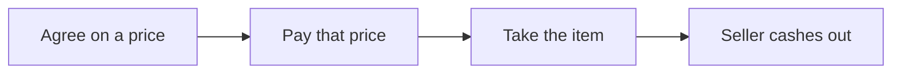

# GhostDeal

**Pay like cash.** You pay the agreed price. The other person never sees your wallet or how much crypto you still hold.

Mobile-first PWA for in-person P2P sales on Starknet [STRK20](https://strk20.starknet.io). A seller lists an item in USDC. A buyer pays that price into private escrow. After the item changes hands, the seller cashes out into a private note.

This is for ordinary people: buying a used PC from a neighbor, not a checkout desk and not a mixer.

[STRK20 Private Sprint](https://strk20.starknet.io/hackathon) · Inspired by [IDEA-12](https://github.com/starkience/strk20-hackathon/blob/main/IDEAS.md) (marketplace escrow) and IDEA-09 (pay by QR / link)

## The idea



Cash already works this way. You hand over a bill. The seller does not get a statement of your bank account. Public crypto usually does the opposite: one payment can expose the rest of the wallet. GhostDeal brings back that cash feeling.

**The advantage:** You pay in private without ever exposing your wallet address or remaining balance to the counterparty.

**We do not promise:** invisibility against a global chain observer. Shield deposits and open-note amounts at cash-out can stay public. Timing can leak.

| Paying from a public wallet | Paying with GhostDeal |
| --- | --- |
| Seller can open your address on an explorer | Seller sees that the price was locked into escrow. No wallet address or balance shared. |
| The rest of your history is often one click away | The rest of your shielded balance stays yours |

## What is public vs private

- **Public:** listing title, price, photo; that it was funded; shield deposit address, token, and amount; open-note amount at cash-out.
- **Private:** who paid, which notes were spent, remaining shielded balance, who received the cash-out note.
- Full map: [docs/privacy.md](docs/privacy.md). How a deal works: [docs/how-it-works.md](docs/how-it-works.md).

## Stack

- Next.js 16, React 19, TypeScript
- starknet.js 10 + get-starknet v6 (Wallet API, Ready wallet)
- Cairo `privacy_invoke` escrow helper (`cairo/`)
- Mainnet STRK20 pool: `0x040337b1af3c663e86e333bab5a4b28da8d4652a15a69beee2b677776ffe812a`

The dapp never holds viewing keys and never calls the Privacy SDK.

## Run locally

```bash
yarn install
cp .env.example .env.local
```

Put your [Alchemy](https://www.alchemy.com) Starknet API key in `NEXT_PUBLIC_PROVIDER_URL`. Mainnet helper is already in `.env.example`. Sepolia is `0x0` (not wired). For a public marketplace set `UPSTASH_REDIS_REST_URL` and `UPSTASH_REDIS_REST_TOKEN`. Never commit `.env.local`.

```bash
yarn dev
```

Open http://localhost:3000. Desktop: Chrome + Ready extension. Phone: open the PWA inside Ready.

```bash
yarn lint
yarn build
```

## Docs site (local)

```bash
python -m venv .venv
.\.venv\Scripts\pip install -r requirements-docs.txt
.\.venv\Scripts\mkdocs serve
```

Then http://127.0.0.1:8000. Start at the [MkDocs home](docs/index.md).

## Reuse

Copy `cairo/` and `src/lib/escrow.ts` into another dapp. This repo is not an npm platform. Do not invent pool or helper addresses: read `src/utils/constants.ts`.

## Acknowledgments

Bootstrapped from the official [STRK20 starter kit](https://github.com/Akashneelesh/strk20-starter-kit) provided for the hackathon. Wallet connect scaffolding in `src/app/components/Wallet/` derives from that kit (copyright Philippe ROSTAN, 2023, MIT). GhostDeal escrow, marketplace, and UI are original work (JaDi03, 2026).

## License

MIT. See [LICENSE](LICENSE).
