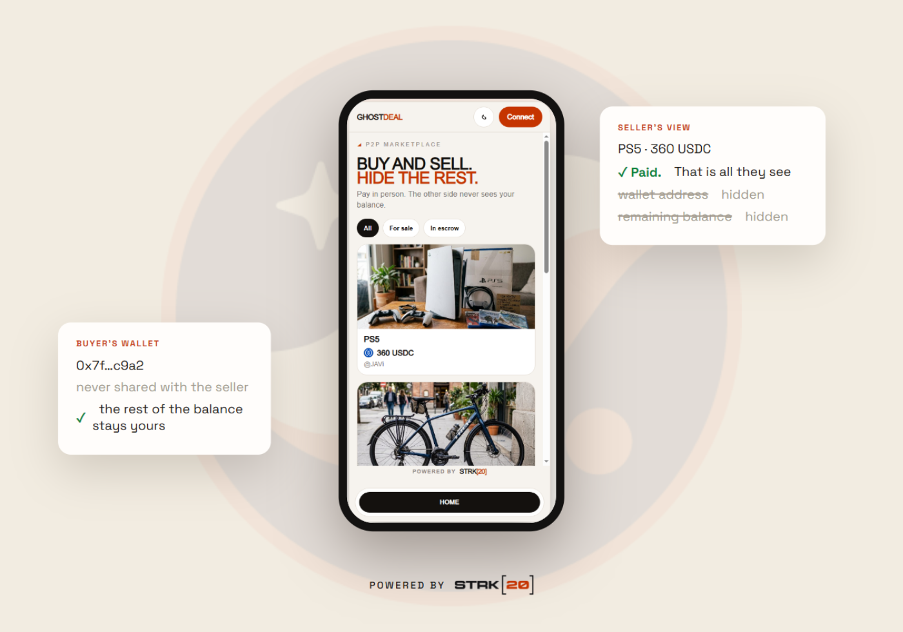

# GhostDeal

**Pay like cash.** You pay the agreed price. The other person never sees your wallet or how much crypto you still hold.




**Try it live:** [ghost-deal.vercel.app](https://ghost-deal.vercel.app) &middot; **Docs:** [how GhostDeal works](docs/index.md). On a phone, open it inside the Ready wallet.

## What the ecosystem was missing

Privacy on Starknet already exists, but it was built for traders: private swaps, private lending, private transfers between wallets. The everyday layer was missing: **buying something from a person, in person.**

Cash works like that. You agree on a price, hand over the bills, take the item home. Nobody asks for your bank statement. Public crypto does the opposite: **one payment puts your whole wallet on display for a stranger.** Your address, your history, your remaining balance, one click away on any explorer. Fine for a trader. Not fine when you are buying a used PC from a neighbor.

GhostDeal is that missing layer: a mobile PWA for ordinary people, for the purchases you already make today. No app store, no sign-up: it opens in the phone's browser and pays from the Ready wallet you already have. The other side sees that the price was paid. Never what else you hold.

## How it works

|  |  |  |
| --- | --- | --- |
| **List it** | **Meet up** | **Get paid** |
| Set a price in USDC or STRK, share the QR | Hand over the item like always | The price lands as a private note. No wallet shown |

If the deal falls through, the buyer cancels and the refund comes back as a private note too.

## The promise, no fine print

**We promise:** the other person does not see your wallet, your balance, or your history. Only the price.

**We do not promise:** invisibility against a chain observer. Pool deposits, cash-out amounts, and timing stay public. We say this plainly, because privacy oversold is privacy broken.

| Paying from a public wallet | Paying with GhostDeal |
| --- | --- |
| The seller opens your address on an explorer and sees your full history | The seller sees that the price was locked into escrow. No address, no balance |
| The rest of your wallet is one click away | The rest of your shielded balance stays yours |

## Why it is actually private

The app never touches your keys. GhostDeal runs on the Starknet Wallet API: your Ready wallet builds and proves the private transactions on your device. Escrow is a small Cairo contract with `privacy_invoke` that only the STRK20 pool can call: no admin key, no upgrade, no custody. Pay and cash out happen inside the pool's shielded zone; the app just orchestrates.

Full details in the [Architecture](docs/architecture.md) page.

## Stack

- Next.js 16, React 19, TypeScript: mobile-first PWA
- starknet.js 10 + get-starknet v6: Starknet Wallet API (`WalletAccountV6`, `strk20InvokeTransaction`)
- Cairo `privacy_invoke` escrow (`cairo/`): Deposit, Claim, Cancel
- Official STRK20 privacy pool on mainnet

## Run locally

```bash
git clone https://github.com/JaDi03/GhostDeal.git
cd GhostDeal
yarn install
cp .env.example .env.local
# put your Alchemy Starknet API key in NEXT_PUBLIC_PROVIDER_URL
yarn dev
```

Open http://localhost:3000. Desktop: Chrome + the Ready extension. Phone: open the PWA inside the Ready app.

## Credits and license

Built for the [STRK20 Private Sprint](https://strk20.starknet.io/hackathon). Bootstrapped from the official [STRK20 starter kit](https://github.com/Akashneelesh/strk20-starter-kit) (Philippe ROSTAN, 2023, MIT); the GhostDeal escrow, marketplace, and UI are original work (JaDi03, 2026). MIT, see [LICENSE](LICENSE).
