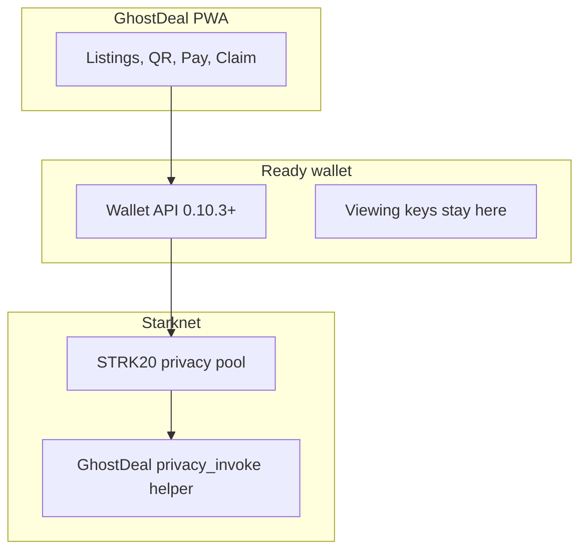

# Architecture

GhostDeal is a **private dapp**: the wallet holds the keys, the app asks it to act, a small Cairo helper is the deal logic.

That is the STRK20 Wallet API route: no proving backend, no custody of notes, no viewing keys in the app.

## Stack

| Layer | What it is in this repo |
| --- | --- |
| UI | Next.js 16 PWA (`src/app/`) |
| Wallet | starknet.js 10, get-starknet discovery 6, Ready. Connect on desktop via the injected picker. Connect on phone inside Ready's in-app browser |
| Actions | `strk20InvokeTransaction` in `src/lib/escrow.ts` |
| Helper | Cairo `privacy_invoke` escrow in `cairo/` |
| Pool | Official STRK20 pool on Mainnet and Sepolia. Addresses live in `src/utils/constants.ts` |

## What the helper does

The pool calls `privacy_invoke` on our contract in the same private transaction as the token movement.

| Op | Job |
| --- | --- |
| `Deposit` | Lock `token` + `amount` against the seller `claimHash`, store the buyer `refundHash`, `closed = false` |
| `Claim` | Seller proves the claim secret. Close the commitment. Return an `OpenNoteDeposit` so the pool credits the seller |
| `Cancel` | Buyer proves the refund secret. Same shape as claim, funds return as a private note |

The helper has no admin key, no upgrade, and no owner functions. Only the pool pinned at construction can call `privacy_invoke`.

## Token Roles & Economics

Listings can be priced in USDC or STRK. Pool fees are always STRK.

| Token | Primary Role | Rationale |
| --- | --- | --- |
| **USDC** | Listing price (native Circle USDC, 6 decimals) | Price stability between listing and meetup. Pay on-chain supports it. |
| **STRK** | Listing price or gas / pool fees | Native Starknet fuel. STRK listings pay in shielded STRK. USDC listings still need shielded STRK for the pool fee. |

### Token-agnostic escrow
The Cairo helper (`cairo/src/lib.cairo`) stores `token: ContractAddress` and `amount: u256`. Pay in this dapp supports STRK and native Circle USDC only (`src/lib/escrow.ts`).

## Shared listings

Listings are off-chain. With `UPSTASH_REDIS_REST_URL` and `UPSTASH_REDIS_REST_TOKEN`, the catalog is shared across phones (`src/lib/marketplaceRedis.ts`); Pay, cash out, and cancel patch the status (`open`, `locked`, or `released`).

## Networks and addresses

Do not copy addresses from memory. Read `src/utils/constants.ts`.

- STRK20 pool Mainnet: `0x040337b1af3c663e86e333bab5a4b28da8d4652a15a69beee2b677776ffe812a`
- STRK20 pool Sepolia: `0x0254a6b2997ef52e9f830ce1f543f6b29768295e8d17e2267d672c552cfe0d91`
- GhostDeal helper Mainnet: `0x1ad47d7b59f736383221af3847aeb737d358e0c2cce947482ca48dad6c4ca72`
- GhostDeal helper Sepolia: `0x2fe8c2bc2194ccdf899c0566057217a34e139c0c5e6f7931f2b24cb436a22cf`
