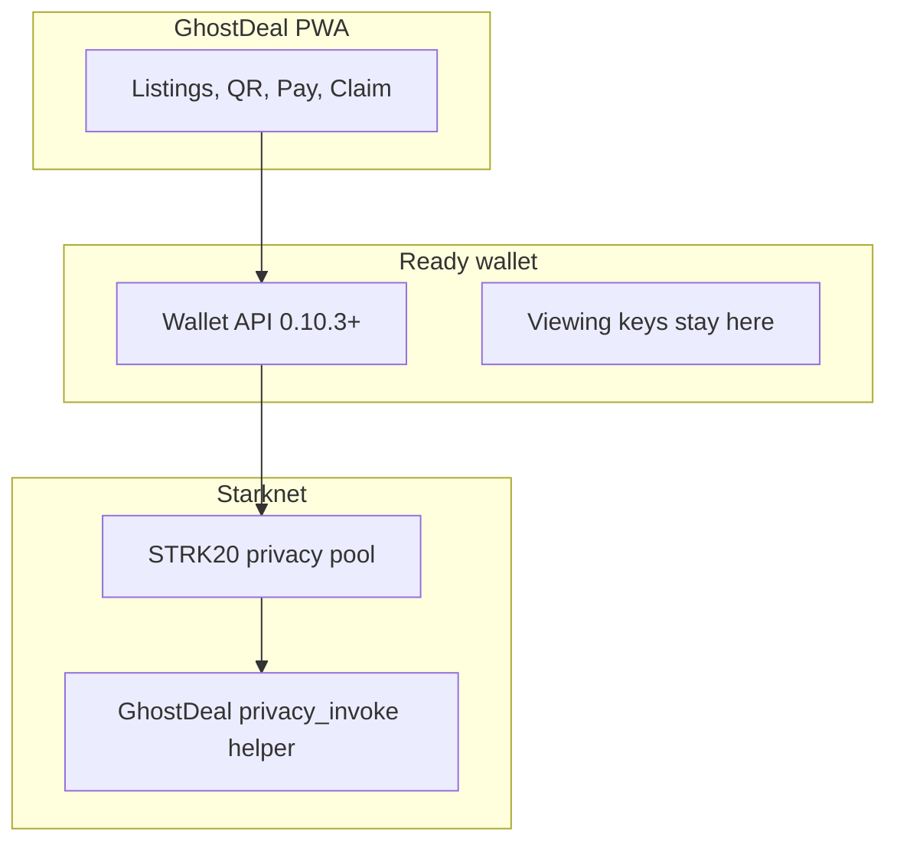

# Architecture

GhostDeal is a **private dapp**: the wallet holds the keys, the app asks it to act, a small Cairo helper is the deal logic.

That is the STRK20 route for consumer apps. We do not run a proving backend and we do not take custody of notes.

## Stack

| Layer | What it is in this repo |
| --- | --- |
| UI | Next.js 16 PWA (`src/app/`) |
| Wallet | starknet.js 10, get-starknet discovery 6, Ready. Connect on desktop via the injected picker. Connect on phone inside Ready's in-app browser |
| Actions | `strk20InvokeTransaction` in `src/lib/escrow.ts` |
| Helper | Cairo `privacy_invoke` escrow in `cairo/` |
| Pool | Official STRK20 pool on Mainnet and Sepolia. Addresses live in `src/utils/constants.ts` |

## What the helper does

The pool calls `privacy_invoke` on our contract in the same private transaction as the token movement.

| Op | Job |
| --- | --- |
| `Deposit` | Lock `token` + `amount` against the seller `claimHash`, store the buyer `refundHash`, `closed = false` |
| `Claim` | Seller proves the claim secret. Close the commitment. Return an `OpenNoteDeposit` so the pool credits the seller |
| `Cancel` | Buyer proves the refund secret. Same shape as claim, funds return as a private note |

The helper has no admin key, no upgrade, and no owner functions. Only the pool pinned at construction can call `privacy_invoke`.

## Token Roles & Economics

GhostDeal separates the listing asset from the gas asset to solve the practical friction of in-person commerce:

| Token | Primary Role | Rationale |
| --- | --- | --- |
| **USDC** | Listing denomination & escrow settlement | **Price stability**: Prevents price slippage or cancelled sales due to volatility between listing creation, transit, and in-person meetup. Buyers and sellers agree on a predictable real-world value. |
| **STRK** | Network execution & gas | **Native Starknet fuel**: Used to pay L2 execution fees and power STRK20 privacy interactions via Ready Wallet. |

### Token-Agnostic Escrow
The Cairo escrow helper (`cairo/src/lib.cairo`) is token-agnostic: it stores `token: ContractAddress` and `amount: u256` inside the deposit commitment. While USDC provides price stability for consumer goods, the contract logic seamlessly supports any asset enabled within the STRK20 privacy pool.

## What we deliberately do not use

| Piece | Why it is absent |
| --- | --- |
| Privacy SDK (`createPrivateTransfers`) | That route is for wallets and key-holding backends. A marketplace must not see viewing keys |
| Shadow accounts / stealth accounts | A different STRK20 surface. GhostDeal's promise is "the other person does not see your balance", which Wallet API + helper already delivers |
| App-mediated private transfer | That would put the app in the custody path |
| Embedded / email wallets | Not privacy-enabled on this stack today |

## Networks and addresses

Do not copy addresses from memory. Read `src/utils/constants.ts`.

- STRK20 pool Mainnet: `0x040337b1af3c663e86e333bab5a4b28da8d4652a15a69beee2b677776ffe812a`
- STRK20 pool Sepolia: `0x0254a6b2997ef52e9f830ce1f543f6b29768295e8d17e2267d672c552cfe0d91`
- GhostDeal helper: `NEXT_PUBLIC_GHOSTDEAL_ESCROW_MAINNET` / `_SEPOLIA`. `0x0` means that network is not wired yet.

The pool is live on mainnet. The helper address is filled after deploy. A "working mainnet product" claim is only true once that mainnet helper is set, the PWA points at it, and real users can Pay without a login wall.
