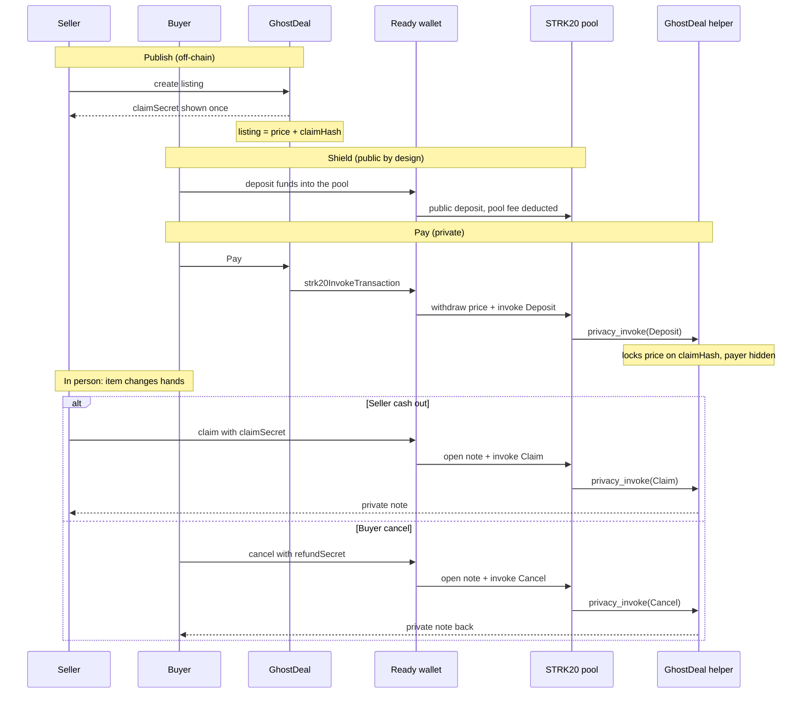
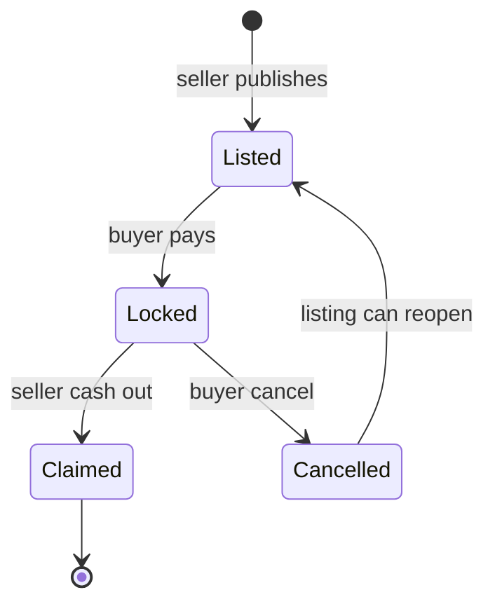

# How a deal works

Same deal, two views: what you do when you meet, and what Starknet does with the payment.

## At the meetup

You found a listing nearby. You agree on a price in USDC. You do not want the seller opening an explorer and seeing the rest of your wallet.

##### What you do

<figure class="gd-role" markdown="1">

<figcaption>Seller</figcaption>
</figure>

  
1. Lists the item + QR

  

  
2. Hands over the item

  

  
3. Cashes out

<figure class="gd-role" markdown="1">

<figcaption>Buyer</figcaption>
</figure>

  
1. Meet / agree price

  

  
2. Pay the listing

  

  
3. Take the item

##### What the chain does

1. **List.** The seller creates the listing on their phone. The app shows a claim secret once, like a backup phrase. The listing carries the price (in USDC) and a hash of that secret. No transaction yet.
2. **Pay.** The buyer opens the listing (QR or link), connects Ready, and pays the price from shielded funds. Funds lock in the GhostDeal escrow. The seller sees that it is paid, not who paid from which notes.
3. **Meet.** The item changes hands in person.
4. **Cash out.** The seller claims with the secret kept on their phone (or pasted from backup). The price lands as a private note. If the deal falls through, the buyer cancels with the refund secret saved at pay time and the listing can reopen.

Shield is public on purpose. The chain sees that someone deposited an amount. After that, Pay and cash-out run as private pool transactions. Observers see the pool move the price into escrow, not which notes were spent or who paid.

## Deal states

On chain, a commitment is either open or `closed`. Claim and cancel both close it. There is no separate "release" function on the helper: the seller already holds the claim secret from list time. The app can still show Release as a step before cash-out.

## Who touches what

| Action | Escrow function | On-chain visibility |
| --- | --- | --- |
| Publish | none | none |
| Shield | none | public deposit to the pool |
| Pay | `privacy_invoke` op `Deposit` | pool to escrow transfer, amount public, payer hidden |
| Cash out | `privacy_invoke` op `Claim` | open-note amount public, receiver hidden |
| Cancel | `privacy_invoke` op `Cancel` | same shape as claim |
| Any read | `get_commitment(claimHash)` | funded / closed, no identities |
