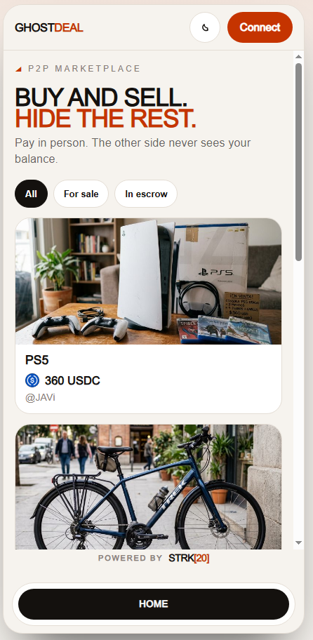
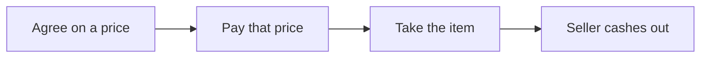

# GhostDeal

**Pay like cash.** You pay the agreed price. The other person never sees your wallet or how much crypto you still hold.

GhostDeal is a mobile PWA for in-person sales on Starknet. A seller lists an item in USDC and shares a QR. A buyer pays that price into private escrow. After the item changes hands, the seller cashes out into a private note.

## What was missing

STRK20 already powers private swaps, lending, and transfers. Day-to-day buying was still awkward.

Meet someone, agree on a price, take the item home. Cash works like that. Public crypto usually does not: one payment can put your whole wallet on display for a stranger on an explorer. That is fine for a trader. It is not fine when you are buying a used bike from a neighbor.

GhostDeal is the everyday layer on top: a local marketplace where paying feels normal and the counterparty only sees that the price was paid, not what you still hold. No DEX UI. No mixer story. No merchant checkout.

## The idea in one picture

With cash, you hand over the amount. The seller is paid. They do not see how much you still have in your pocket. GhostDeal brings that same feeling to Starknet.

## How your deal stays private

!!! success "Payment goes direct. Wallets stay private."
    Pay moves only the listing price from shielded funds. The app never shares either person's wallet address with the other side. The UI never shows a counterparty balance. The rest of either wallet stays with its owner.

!!! note "Built for the person across the table"
    GhostDeal protects you from the other party in the deal. A dedicated analyst with chain forensics tools and time could still correlate public on-chain steps. Your neighbor at the meetup cannot.

## Public crypto vs GhostDeal

| | Paying from a public wallet | Paying with GhostDeal |
| --- | --- | --- |
| What the seller can see | Your wallet address and often your full payment history on an explorer | That the price was locked into escrow. No wallet address or balance shared. |
| What you pay | The price, plus a public link to your wallet | The listing price, from shielded funds (USDC) |
| After the sale | That address can keep being watched on-chain | The rest of your shielded balance stays yours |

## Explore

- [How a deal works](how-it-works.md): the four steps, then the protocol sequence.
- [What is private](privacy.md): hidden vs public, stated honestly.
- [Architecture](architecture.md): Wallet API + `privacy_invoke` helper. The dapp never holds viewing keys.
- [Run locally](run.md): clone, env, `yarn dev`.

## Acknowledgments

Bootstrapped from the official [STRK20 starter kit](https://github.com/Akashneelesh/strk20-starter-kit). Wallet scaffolding derives from that kit (Philippe ROSTAN, 2023, MIT). GhostDeal escrow, marketplace, and UI are original work (JaDi03, 2026). See [LICENSE](https://github.com/JaDi03/GhostDeal/blob/main/LICENSE).
