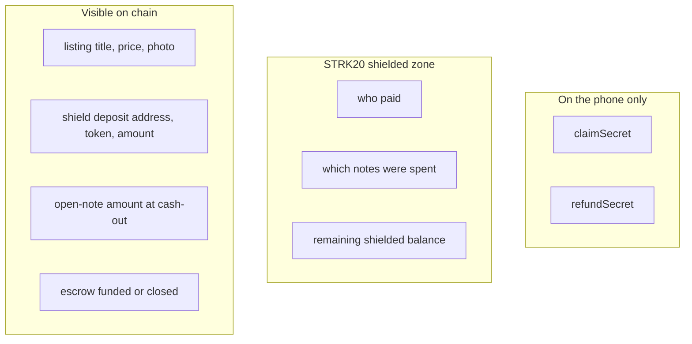

# What is private

GhostDeal uses STRK20 so a payment can feel like cash: the other person learns that the price was paid, not how rich you are.

This page is the privacy map. It is not a flow. Hidden and public facts do not belong on the same arrows as Pay and Claim.

## Three places a fact can live

- **Device.** Secrets never go to a GhostDeal server. The seller's claim secret is shown once at publish. The buyer's refund secret is saved at pay time. Anyone with a claim secret can cash out, so treat it like a backup phrase.
- **Shielded zone.** After a shield, notes, nullifiers, and remaining balances are pool business. The dapp never holds viewing keys. Ready constructs and proves the private transaction.
- **Public chain.** Listings are meant to be shared. Shielding is a public deposit by design. Open notes at cash-out publish the amount so the helper can credit the right size.

## Hidden vs public

| Public | Private |
| --- | --- |
| Listing title, price, photo URL | Who paid |
| That a listing was sold / funded | Which notes were spent |
| Shield deposit: address, token, amount | Remaining shielded balance |
| Open-note amount when the seller cashes out | Receiver of that private note |
| Escrow `get_commitment`: funded or closed | Identities of buyer and seller |

The UI never shows a counterparty balance, public or shielded.

## What we are not

GhostDeal is not a mixer product and not a way to hide stolen funds.

The honest sentence for a judge or a user:

> The other person does not see your wallet or the rest of your balance. A chain observer can still see public deposits, open-note amounts, and timing.

Unlinkability against a global observer is not a promise we make.

## Trust boundary

| Role | Holds viewing keys? | What they see |
| --- | --- | --- |
| GhostDeal PWA | no | Listings, local secrets, escrow reads |
| Ready wallet | yes, on the device | Builds, proves, and submits private actions |
| STRK20 pool | no (encrypted notes) | Proofs, nullifiers, public deposits and open amounts |
| GhostDeal helper | no | Token, amount, hashes, `closed`. No identities |
| RPC provider | no | Which commitments this IP queries |

The dapp uses the Starknet Wallet API (`WalletAccountV6`, `strk20InvokeTransaction`). It must not call the Privacy SDK and must not ask the user for a viewing key.
