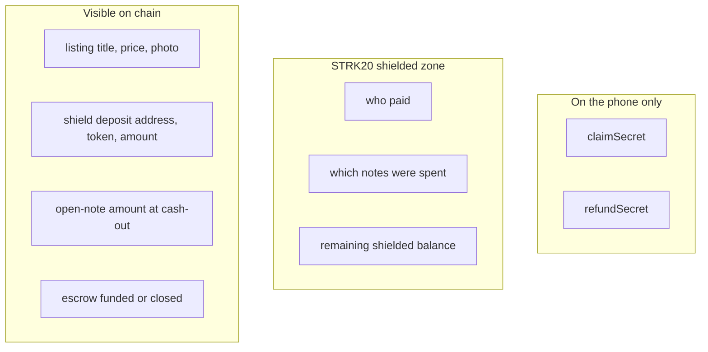

# What is private

GhostDeal uses STRK20 so a payment can feel like cash: the other person learns that the price was paid, not how rich you are.

## Three places a fact can live

- **Device.** Secrets never go to a GhostDeal server. The seller's claim secret is shown once at publish. The buyer's refund secret is saved at pay time. Anyone with a claim secret can cash out, so treat it like a backup phrase.
- **Shielded zone.** After a shield, notes, nullifiers, and remaining balances are pool business. The dapp never holds viewing keys. Ready constructs and proves the private transaction.
- **Public chain.** Listings are meant to be shared. Shielding is a public deposit by design. Open notes at cash-out publish the amount so the helper can credit the right size.

## Honest limits

GhostDeal is not a mixer and not a way to hide stolen funds. It protects you from the person across the table, not from a chain observer: shield deposits, open-note amounts, and timing stay public. We do not promise unlinkability against a determined analyst.

## Trust boundary

| Role | Holds viewing keys? | What they see |
| --- | --- | --- |
| GhostDeal PWA | no | Listings, local secrets, escrow reads |
| Ready wallet | yes, on the device | Builds, proves, and submits private actions |
| STRK20 pool | no (encrypted notes) | Proofs, nullifiers, public deposits and open amounts |
| GhostDeal helper | no | Token, amount, hashes, `closed`. No identities |
| RPC provider | no | Which commitments this IP queries |
